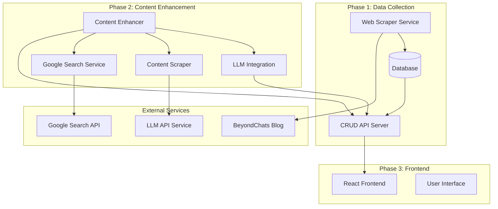

# Design Document

## Overview

The BeyondChats Article System is a three-phase full-stack application that automates article collection, enhancement, and presentation. The system architecture follows a microservices approach with clear separation between scraping services, API layer, AI enhancement pipeline, and frontend presentation.

The system processes articles through a pipeline: scraping → storage → enhancement → publication → presentation. Each phase is designed to be independently deployable and scalable, with robust error handling and monitoring capabilities.

## Architecture

The system follows a layered architecture with the following main components:



## Components and Interfaces

### Web Scraper Service
- **Purpose**: Extract articles from BeyondChats blog
- **Technology**: Node.js with Puppeteer/Cheerio
- **Interfaces**: 
  - Input: BeyondChats blog URL
  - Output: Structured article data to database
- **Key Functions**:
  - Navigate to last page of blogs
  - Extract 5 oldest articles
  - Parse article metadata and content

### Database Layer
- **Purpose**: Persistent storage for articles and metadata
- **Technology**: MySQL
- **Schema Design**:
  - Articles table with fields: id, title, content, url, scraped_date, enhanced_content, references
  - Indexes on title and scraped_date for efficient querying

### CRUD API Server
- **Purpose**: RESTful interface for article management
- **Technology**: Node.js with Express.js
- **Endpoints**:
  - GET /api/articles - List all articles
  - GET /api/articles/:id - Get specific article
  - POST /api/articles - Create new article
  - PUT /api/articles/:id - Update article
  - DELETE /api/articles/:id - Delete article

### Content Enhancement Pipeline
- **Purpose**: AI-powered article improvement
- **Components**:
  - Google Search integration for finding reference articles
  - Content scraper for extracting reference material
  - LLM integration for content generation
  - Publishing service for updated articles

### React Frontend
- **Purpose**: User interface for article browsing
- **Technology**: React.js with responsive design
- **Features**:
  - Article listing with original/enhanced toggle
  - Responsive layout for mobile and desktop
  - Professional UI with modern design patterns

## Data Models

### Article Model
```typescript
interface Article {
  id: string;
  title: string;
  content: string;
  url: string;
  scrapedDate: Date;
  enhancedContent?: string;
  references?: Reference[];
  isEnhanced: boolean;
  metadata: {
    wordCount: number;
    readingTime: number;
    tags: string[];
  };
}
```

### Reference Model
```typescript
interface Reference {
  id: string;
  url: string;
  title: string;
  content: string;
  scrapedDate: Date;
  relevanceScore: number;
}
```

### Enhancement Request Model
```typescript
interface EnhancementRequest {
  articleId: string;
  originalContent: string;
  references: Reference[];
  enhancementPrompt: string;
  status: 'pending' | 'processing' | 'completed' | 'failed';
}
```

## Correctness Properties

*A property is a characteristic or behavior that should hold true across all valid executions of a system-essentially, a formal statement about what the system should do. Properties serve as the bridge between human-readable specifications and machine-verifiable correctness guarantees.*

Based on the prework analysis, I'll now define the key correctness properties that need to be validated:

Property 1: Article scraping completeness
*For any* BeyondChats blog page, when the Web_Scraper processes it, exactly 5 articles should be extracted with all required fields (title, content, publication date, URL) populated
**Validates: Requirements 1.2, 1.3**

Property 2: Database storage round-trip consistency
*For any* article data, storing it in the database and then retrieving it should return identical content and metadata
**Validates: Requirements 1.4, 1.5**

Property 3: CRUD API completeness
*For any* valid article data, the CRUD API should support all operations (create, read, update, delete) and maintain data consistency across operations
**Validates: Requirements 2.1, 2.2, 2.3, 2.4, 2.5**

Property 4: Content enhancement pipeline integrity
*For any* article processed through the enhancement pipeline, the system should successfully search Google, extract reference content, generate enhanced content, and include proper citations
**Validates: Requirements 3.1, 3.2, 3.3, 3.4, 3.5**

Property 5: Enhanced article publishing consistency
*For any* enhanced article, publishing should maintain the relationship between original and enhanced versions while preserving all reference citations
**Validates: Requirements 4.1, 4.2, 4.3**

Property 6: Frontend API integration
*For any* frontend request, the interface should successfully fetch data from the CRUD API and display both original and enhanced versions when available
**Validates: Requirements 5.1, 5.2, 5.5**

Property 7: External service error resilience
*For any* external service failure (Google API, LLM API, web scraping), the system should handle errors gracefully, log appropriately, and maintain system stability
**Validates: Requirements 4.5, 6.5, 7.2, 7.3, 7.5**

Property 8: Responsive UI adaptation
*For any* viewport size, the frontend interface should adapt its layout appropriately to provide optimal user experience
**Validates: Requirements 5.3**

Property 9: API authentication and rate limiting
*For any* external API connection, the system should implement proper authentication and respect rate limiting constraints
**Validates: Requirements 7.1, 7.4**

## Error Handling

The system implements comprehensive error handling across all layers:

### Web Scraping Errors
- Network timeouts and connection failures
- Invalid HTML structure or missing elements
- Rate limiting from target websites
- Robots.txt compliance violations

### Database Errors
- Connection failures and timeouts
- Constraint violations and data integrity issues
- Transaction rollback scenarios
- Migration and schema update failures

### API Errors
- Invalid request formats and missing parameters
- Authentication and authorization failures
- Resource not found scenarios
- Server overload and rate limiting

### External Service Errors
- Google Search API failures and quota limits
- LLM API timeouts and content policy violations
- Reference website scraping failures
- Network connectivity issues

### Frontend Errors
- API communication failures
- Invalid data rendering scenarios
- Browser compatibility issues
- Responsive layout failures

## Testing Strategy

The system employs a dual testing approach combining unit tests and property-based tests:

### Unit Testing Approach
- **API Endpoints**: Test each CRUD operation with specific examples
- **Scraping Functions**: Test with known HTML structures and edge cases
- **Database Operations**: Test with specific data scenarios and constraints
- **Frontend Components**: Test rendering and user interaction scenarios
- **Error Handling**: Test specific error conditions and recovery mechanisms

### Property-Based Testing Approach
- **Framework**: Use fast-check for JavaScript/TypeScript property-based testing
- **Test Configuration**: Minimum 100 iterations per property test
- **Coverage**: Each correctness property implemented as a single property-based test
- **Generators**: Smart generators that create realistic test data within valid input spaces

**Property-Based Test Requirements**:
- Each property-based test must run a minimum of 100 iterations
- Tests must be tagged with comments referencing the design document property
- Tag format: `**Feature: beyondchats-article-system, Property {number}: {property_text}**`
- Each correctness property must be implemented by exactly one property-based test

### Integration Testing
- End-to-end pipeline testing from scraping to frontend display
- External service integration testing with mocked responses
- Database migration and data consistency testing
- Cross-browser and responsive design testing

### Performance Testing
- API response time benchmarks
- Database query optimization validation
- Frontend loading and rendering performance
- Concurrent user load testing

## Security Considerations

### Data Protection
- Sanitize all scraped content to prevent XSS attacks
- Implement proper input validation for all API endpoints
- Use parameterized queries to prevent SQL injection
- Encrypt sensitive configuration data and API keys

### External Service Security
- Implement secure API key management
- Use HTTPS for all external communications
- Validate and sanitize all external content
- Implement proper CORS policies for frontend API access

### Rate Limiting and Abuse Prevention
- Implement API rate limiting to prevent abuse
- Use respectful scraping practices with appropriate delays
- Monitor and log suspicious activity patterns
- Implement circuit breakers for external service calls

## Deployment Architecture

### Development Environment
- Local development with Docker containers
- Hot reloading for frontend development
- Local database instance with test data
- Mock external services for offline development

### Production Environment
- Containerized deployment with Docker
- Separate services for scraping, API, and frontend
- Managed database service (MySQL on cloud)
- CDN for frontend static assets
- Load balancing for API services

### CI/CD Pipeline
- Automated testing on all pull requests
- Property-based tests included in CI pipeline
- Automated deployment to staging environment
- Manual approval for production deployments
- Database migration automation

## Monitoring and Observability

### Logging Strategy
- Structured logging with consistent format
- Separate log levels for different components
- Centralized log aggregation and analysis
- Error tracking and alerting systems

### Metrics and Monitoring
- API response time and error rate monitoring
- Database performance and connection pool metrics
- External service availability and response time tracking
- Frontend performance and user experience metrics

### Health Checks
- Service health endpoints for all components
- Database connectivity and performance checks
- External service availability monitoring
- Automated alerting for service degradation